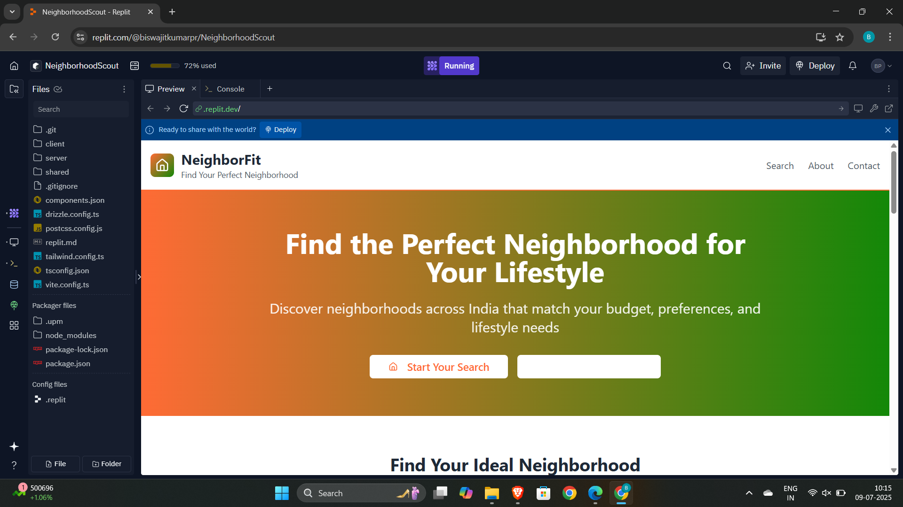
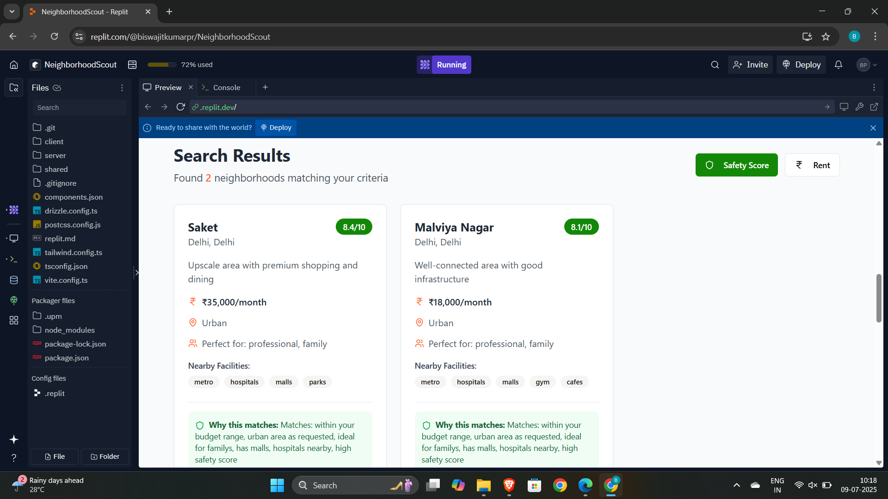
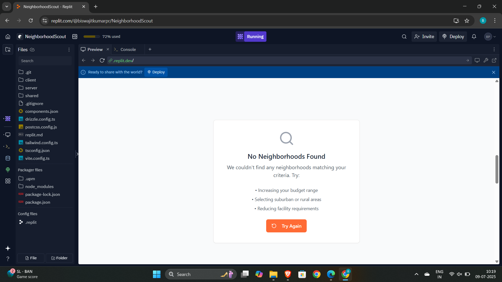

# 🇮🇳 NeighborFit – Indian Neighborhood Recommendation System

**NeighborFit** is a full-stack web application built to help Indian users discover the most suitable neighborhoods to live in — based on their **budget**, **area type**, **state**, **lifestyle**, and access to nearby **facilities** like gyms, metros, hospitals, colleges, etc.

Unlike property listing platforms, this tool focuses on **finding the right neighborhood** — not just available properties. It’s built using custom logic, not AI or external APIs.

---

## 🎯 Objective

> _“Where should I live that fits my budget, safety needs, and lifestyle — especially when moving to a new Indian city?”_

This app solves that by matching user preferences to Indian neighborhood data.

Ideal for:
- 🧑‍🎓 Students  
- 👨‍💼 Working professionals  
- 👨‍👩‍👧 Families relocating or apartment hunting  

---

## 🛠 Tech Stack

| Layer       | Tech Used                    |
|-------------|------------------------------|
| Frontend    | HTML, CSS, JavaScript        |
| Backend     | Node.js, Express.js          |
| Styling     | Tailwind CSS (used in Replit)|
| Platform    | Built & tested on Replit     |
| Data Format | JSON Dataset (Indian localities)

---

## 🔧 Features

✅ Select **State** (e.g., Delhi, Karnataka)  
✅ Choose **Area Type** (Urban / Suburban /Rural)  
✅ Choose **User Type** (Student / Family / Working Professional)  
✅ Set a **Budget Range** using slider  
✅ Filter by **Facilities**: Metro, Hospitals, Gyms, Malls, Parks, etc.  
✅ Get a list of best-matching neighborhoods  
✅ Each result includes:
- Area name  
- Monthly rent  
- Facilities  
- Suitability  
- **Safety Score**
- ✅ A clear “Why this matches” reason

✅ ❌ If no match found → Suggestions are shown to adjust filters

---

## 📊 Sample API Input

```json
{
  "minBudget": 12000,
  "maxBudget": 20000,
  "type": "urban",
  "state": "Karnataka",
  "userType": "working professionals",
  "facilities": ["gym", "metro"]
}
```

---

## 🧾 Sample Neighborhood Data

```json
{
  "name": "JP Nagar",
  "city": "Bangalore",
  "state": "Karnataka",
  "type": "urban",
  "average_rent": 18000,
  "suitable_for": ["working professionals", "families"],
  "safety_score": 4.7,
  "facilities": ["metro", "gym", "hospitals", "cafes"]
}
```

---

## ✅ Sample Output

```json
[
  {
    "name": "JP Nagar",
    "city": "Bangalore",
    "state": "Karnataka",
    "type": "urban",
    "average_rent": 18000,
    "safety_score": 4.7,
    "facilities": ["metro", "gym", "hospitals", "cafes"],
    "reason": "Matches your urban preference, budget ₹12000–₹20000, and includes gym, metro"
  }
]
```

---

## ❌ No Match Found

If no neighborhood matches the filters, show:

```json
{
  "message": "No neighborhoods found. Try increasing your budget, selecting suburban areas, or reducing facility filters."
}
```

---

## 📸 Screenshots

### 🏠 Landing Page  
> Clean and user-friendly homepage with CTA to begin search  


---

### 📝 User Input Form  
> Choose location, area type, budget range, user category, and required facilities  


---

### ✅ Matching Results  
> Shows suitable areas with rent, safety score, facilities, and match explanation  


---

### ❌ No Match Found  
> Friendly message with tips to adjust filters  


---

## 🌟 Why This Project is Unique

- 🇮🇳 Entirely focused on **Indian neighborhoods**
- 💡 Matches **real-life constraints**: budget, safety, access
- 🔧 No AI/ML — built with **custom backend logic**
- 🎯 Suggests **where to live**, not what to rent
- ✅ Works even with low or mid-range budgets

---

## 🚀 Future Improvements

- Add map-based preview (Google Maps / OSM)
- Add login and save preferences
- Pull live rent data from public APIs
- User ratings for neighborhoods

---

## 👨‍💻 Developer Info

Made with ❤️ by **[Biswajit kumar pradhan]**  
Btech CSE Student  
Focused on solving practical problems with meaningful tech.

---

## 📎 License

Free to use for learning and demo purposes only.
